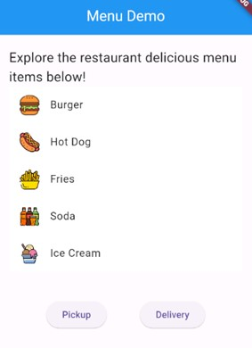

# Tarea 3 | Analizando layouts

# Temas:
-	Utilizar colores
-	Utilizar iconos
-	Utilizar Containers con esquinas redondeadas y colores
-	Utilizar textos con style
-	Utilizar stacks
-	Utilizar imágenes 
-	Utilizar paddings
-	Utilizar columnas y filas y sus alineaciones
-	Utilizar assets (assets en el repo, agregar al pubspec).

# Lo que más me costo
-	El generar fue la apariencia de los datos deseados y el gestionar la estructura de la app. Además de entender los requerimientos en algunas partes

# Lo que aprendí:
-	A utiliza las funciones dentro de widgets.
-	A usar alerts.
-	Generar cambios en contenedores a necesidad.
-	Utiliza los objetos tipo listas.
 
# Material App Bar:
Esta aplicación es una interfaz donde se podrá pedir alimentos por delivery o pickup de tal manera que seleccionas solo un alimento a la vez y al presionar el alimento te mencionara que lo has seleccionado.

